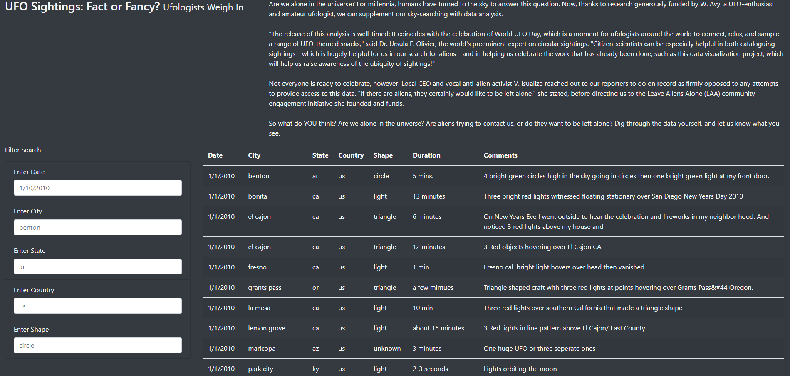

# UFOs

## Overview of Project

This project is created to put UFO data - an article and a table of sightings with filters on date, city, state, country and shape from a JavaScript file in an HTML page.

## Results

This is the original unfiltered data:

- If someone wants to filter the table to get only sightings that happened on 1/4/2010 they can do it by entering "1/4/2010" in an "Enter Date" box and get only needed results.

- If someone wants to filter the table to get only sightings that happened in a particular city, for instance,  El Cajon, they can get this data by  entering "el cajon" in an "Enter City" box.

  

- I someone interested in only Texas UFO sightings they can put "tx" in the  "Enter State" box.

  

- If you need an information about only Canada sightings you can filter the table in the "Enter Country" box.

  

- And finally, if you need to know only about sightings with certain shape you can do it by filtering the table in the  "Enter Shape" box.

  

- The filters also can be applied together

  

## Summary 

Therefore users can see the article, the table of UFO sightings data and  filter it by five parameters. The drawback of this design is that there is no way users can communicate to owners of the web page. There are some question and request to let them know what users think about given information but no place to reply.

For further development I would recommend to add a "feedback" or "contact us" input box(es) and create a responsive map of the sightings for better visual representation of the data.
